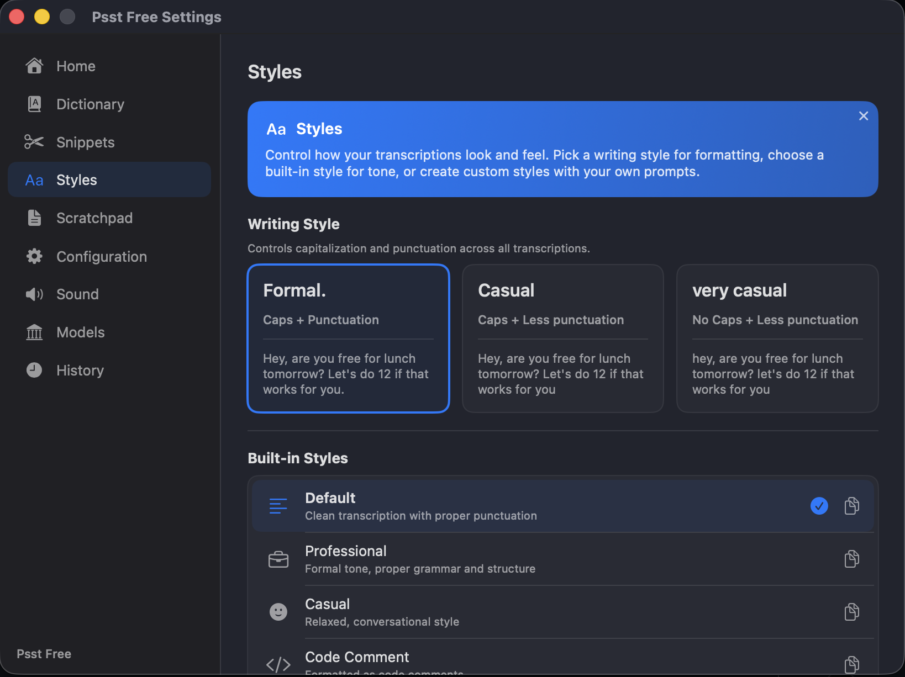

# Psst Free


[](https://github.com/dougwithseismic/psst-free/releases/tag/v1.0.1)

**Free, open-source alternative to [WisperFlow](https://wisperflow.com) and [SuperWhisper](https://superwhisper.com).**

On-device speech-to-text for macOS. Press a hotkey, talk, and your words appear wherever your cursor is. No cloud. No subscription. No data leaves your Mac.

Powered by [WhisperKit](https://github.com/argmaxinc/WhisperKit) — Apple's CoreML-optimized Whisper running entirely on your hardware.

<p align="center">
  
</p>

## Download

**[Download the latest release](https://github.com/dougwithseismic/psst-free/releases/latest)**

> This is an ad-hoc signed build. On first launch, right-click the app → **Open** to bypass macOS Gatekeeper.

## Features

- **Completely free** — no trials, no license keys, no limits
- **100% on-device** — transcription runs locally via WhisperKit, nothing is sent to any server
- **Menu bar app** — lives in your menu bar, stays out of the way
- **Global hotkeys** — hold-to-record or toggle mode, fully customizable key combos
- **Auto-paste** — transcribed text is automatically pasted into whatever app you're using
- **Multiple transcription modes** — Default, Professional, Casual, Code Comment, Bullet Points
- **Custom modes** — create your own with prompt templates (`{{text}}` placeholder)
- **Vocabulary & snippets** — custom word replacements and text expansion
- **Writing styles** — apply formatting preferences to output
- **Whisper model selection** — choose from multiple model sizes to balance speed vs accuracy

## How It Works

1. Press your hotkey (default: hold `Fn`)
2. Speak
3. Release — text appears in your current app

That's it.

## Installation

1. Download `PsstFree-x.x.x.dmg` from [Releases](https://github.com/dougwithseismic/psst-free/releases/latest)
2. Open the DMG and drag **Psst Free** to your Applications folder
3. Launch the app — right-click → **Open** on first launch
4. Grant the permissions it asks for:
   - **Accessibility** — needed for global hotkeys and paste automation
   - **Input Monitoring** — needed for capturing key events
   - **Microphone** — needed for recording your voice

## Requirements

- macOS 14 (Sonoma) or later
- Apple Silicon or Intel Mac

## Building from Source

```bash
# Clone
git clone https://github.com/dougwithseismic/psst-free.git
cd psst-free

# Build and run (debug)
swift build -c debug
./scripts/dev-build.sh --run

# Build release DMG
./build-app.sh
# Output: dist/PsstFree-x.x.x.dmg
```

## Why?

WisperFlow and SuperWhisper are great tools — but they cost money for something your Mac can do natively. Psst Free gives you the same core experience for free, with no strings attached.

## Built by

[withseismic.com](https://withseismic.com)

## License

MIT
